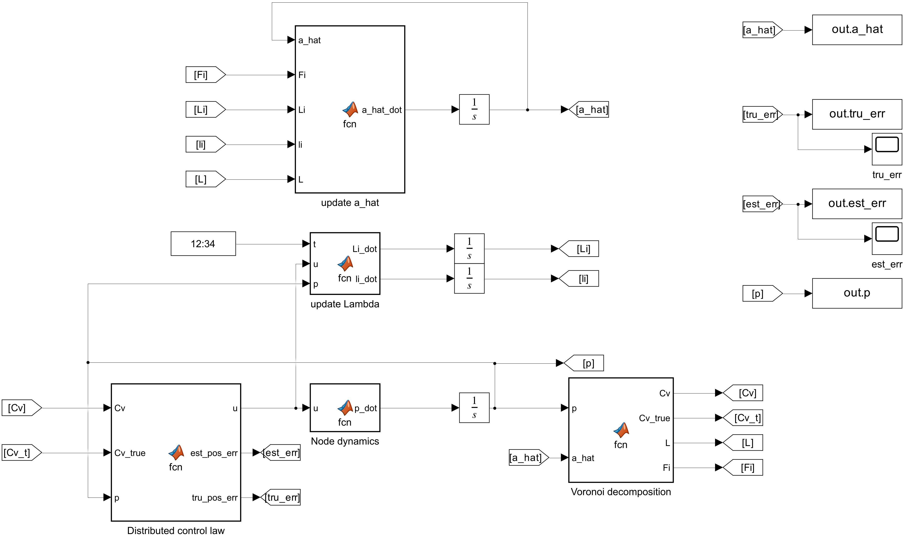

# Coverage Control of a Fleet of Robots in 1D and 2D Space

This repository contains the code and simulations for the project on coverage control for a fleet of mobile robots operating in both one-dimensional (1D) and two-dimensional (2D) spaces. 

The complete report is available [here](./media/Tesina.pdf).

### 1D Problem
In the 1D scenario, the robots are constrained to move along a circular path. The goal is to minimize the coverage cost function, which is the maximum time it takes for any sensor to reach any point on the circle. Control laws are designed to optimize the sensor positions while accounting for real-world conditions such as measurement errors and intermittent distance readings. Simulations are conducted to test the robustness of the control law under these conditions, and to test the capability of the controller in maintaining such optimal formation while moving in the space.

<div align="center">
  
  <p><em>1D Coverage Control Simulation</em></p>
</div>

### 2D Problem
The 2D problem extends the coverage control to a bounded convex region. The robots aim to cover areas of high sensory interest using local measurements. The sensory function, which represents the importance of different areas, is unknown to the robots. An adaptive control law is introduced to learn this function, and a consensus-based control law is used to propagate sensory information across the network, improving the overall coverage.

<div align="center">
  
  <p><em>2D Coverage Control Simulation</em></p>
</div>

## 1D Coverage Control

### Problem Description
In the 1D problem, the robots are tasked with optimizing their positions along a circular path to minimize the time it takes for any robot to reach any point on the circle. The control law adapts the robot positions based on local sensor measurements while accounting for real-world constraints such as position measurement errors.

The problem is described by the following coverage cost function:

```math
T(q_1, q_2, ..., q_n) = \max_{q \in S} \min_{i \in \{1, 2, ..., n\}} \frac{d(q_i, q)}{\lambda_i}
```

Where:
- $S$ is the set of all points on the circle.
- $d(q_i, q)$ is the shortest distance between sensor $i$ and point $q$.
- $\lambda_i$ is the maximum velocity of sensor $i$.

### Control Law Implementation
The control law used in this work was introduced by Song et al., and aims to drive the sensor network to an optimal configuration while accounting for measurement errors. The control input is defined as:

```math
u_i(k) = \lambda_i \, \text{sat}_{\pm1} ( \tilde{u}_i(k) )
```

Where:

```math
\tilde{u}_i(k) = \eta_i \left( (\lambda_{i-1} + \lambda_i) \tilde{d}_{i,i+1}(k) + (\lambda_i + \lambda_{i+1}) \tilde{d}_{i,i-1}(k) \right)
```

The estimated distance between sensors $i$ and $j$ is given by:

```math
\tilde{d}_{i,j}(k) = \frac{ \hat{d}_{i,j}(k) + \check{d}_{i,j}(k) }{2}
```

Where:
- $\hat{d}_{i,j}(k)$ is the upper bound of the distance estimate.
- $\check{d}_{i,j}(k)$ is the lower bound of the distance estimate.

These bounds are updated at each time step using the following equations:

```math
\check{d}_{i,j}(k+1) = \max \left\{ \bar{d}_{i,j}(k+1) - \bar{\delta}_{i,j}, \check{d}_{i,j}(k) + u_j(k) - u_i(k) \right\}
```

```math
\hat{d}_{i,j}(k+1) = \min \left\{ \bar{d}_{i,j}(k+1) + \bar{\delta}_{i,j}, \hat{d}_{i,j}(k) + u_j(k) - u_i(k) \right\}
```

Where:
- $\bar{d}_{i,j}(k)$ is the average measured distance between sensors $i$ and $j$.
- $\bar{\delta}_{i,j}$ is the average measurement error.

### Simulations
The simulations demonstrate the effectiveness of the control law in achieving near-optimal coverage. Various scenarios are tested, including the impact of measurement errors and the use of pinning control to maintain sensor formation during movement.

<div align="center">
  
  <p><em>1D Simulation Results with measurement errors, initial and final position</em></p>
</div>


#### Pinning control
The sensors are able to maintain formation while in motion, albeit with an increase in steady-state error as the pinner velocity increased.
<div align="center">
  
  <p><em>1D Simulation Results with measurement errors, different sensors maximum velocities, and pinning control</em></p>

</div>

<p>&nbsp;</p>

<div align="center">
  
  <p><em>1D Simulation Results with measurement errors, near optimal value maintained during </em></p>
</div>


## 2D Coverage Control

### Problem Description
In the 2D problem, the robots are tasked with adaptively positioning themselves in a bounded convex environment. The goal is to minimize a cost function based on the distance from each robot to points of interest, weighted by a sensory function $\varphi(q)$ that represents the importance of each point in the environment. The sensory function is unknown to the robots that must learn it only using local measurements.

The cost function for the 2D problem is defined as:

```math
H(p_1, ..., p_n) = \sum_{i=1}^{n} \int_{V_i} \frac{1}{2} \| q - p_i \|^2 \varphi(q) \, dq
```

Where:
- $V_i$ is the Voronoi region of robot $i$.
- $\varphi(q)$ is the sensory function.

<div align="center">
  
  <p><em>2D Sensory Function Values</em></p>
</div>

### Control Law Implementation
The control law used to move each robot towards the estimated centroid of its Voronoi region is:

```math
u_i = K \left( \hat{C}_{V_i} - p_i \right)
```

Where $\hat{C}_{V_i}$ is the centroid of the Voronoi region $V_i$ and $K$ is the control gain matrix. The sensory function is approximated using a basis function model:

```math
\hat{\varphi}_i(q, t) = K(q)^T \hat{a}_i(t)
```

The robots learn the sensory function $\hat{\varphi}(q)$ using an adaptation law. The parameters for each robot are updated using the following estimation laws:

```math
\dot{\Lambda}_i(t) = w(t) K_i(t) K_i(t)^T
```

```math
\dot{\lambda}_i(t) = w(t) K_i(t) \varphi_i(t)
```

Where $w(t) \geq 0$ is a data collection weighting function, $K_i(t)$ represents the value of the basis functions at the robot's position, and $\varphi_i(t)$ is the sensory measurement taken by robot $i$ at time $t$.

The pre-adaptation law for the parameter vector $\hat{a}_i$ is given by:

```math
\dot{\hat{a}}_{\text{pre},i} = -F_i \hat{a}_i - \gamma (\Lambda_i \hat{a}_i - \lambda_i)
```

Where $F_i$ is a feedback term derived from the basis functions and the current estimate of the parameters, and $\gamma > 0$ is a learning rate gain.

To avoid singularities, the final adaptation law uses a projection mechanism that ensures that the parameters remain above a minimum threshold.


### Simulations
The 2D simulations show that the robots can adaptively position themselves in areas of high sensory interest. However, without any communication between the agents, the approximations of the sensory function are only locally true. While the estimated error is brought to zero, the true error converges to a steady state value.

<div align="center">
  
  <p><em>2D Simulation Results without consensus</em></p>
</div>

<div align="center">
  
  <p><em>2D Simulation Results, errors without consensus</em></p>
</div>

The use of a skew symmetric component can only slightly increase the gathered information by making the trajectories of the robots more complex. On the other hand, the introduction of a consensus control law can reliably achieve a globally true approximation of the sensory function, thus a zero estimated and true position error. The control law is modified as it follows:

```math
\dot{\hat{a}}_{\text{pre}_i} = -F_i \hat{a}_i - \gamma (\Lambda_i \hat{a}_i - \lambda_i) - \zeta \sum_{j=1}^{n} l_{ij} (\hat{a}_i - \hat{a}_j)
```
where $\zeta > 0$ is a consensus gain. $l_{ij}$ is a weighting factor equal to the length of the shared Voronoi edge, or zero if robot \(i\) and \(j\) are not neighbors.


<div align="center">
  
  <p><em>2D Simulation Results with consensus</em></p>
</div>

<div align="center">
  
  <p><em>2D Simulation Results, errors with consensus</em></p>
</div>


## Usage

To run the simulations, execute the two scripts Coverage1Dmain and Coverage2Dmain in their respective subfolder. The output of the simulation will be shown on the screen and saved as an eps in the /img/ subfolder To change the parameters, modify the scripts coverage1D_parameters.m and coverage2D_parameters.m.

## Report Access

For detailed analysis, refer to the complete report by clicking the button below.

<div align = center>

  [<kbd> <br> Go to the complete report <br> </kbd>][pdf]

</div>

[pdf]: https://github.com/valentinomario/Coverage-Control/blob/main/media/Tesina.pdf

## References

1. Song, C., Qin, J., Wang, L., & Li, H. (2020). Coverage control for heterogeneous mobile sensor networks with bounded position measurement errors. *Automatica*, 120, 109118. https://doi.org/10.1016/j.automatica.2020.109118
2. Song, C., Qin, J., Wang, L., & Li, H. (2016). Coverage control for heterogeneous mobile sensor networks on a circle. *Automatica*, 63, 349–358. https://doi.org/10.1016/j.automatica.2015.10.044
3. Schwager, M., Rus, D., & Slotine, J.-J. (2009). Decentralized, adaptive coverage control for networked robots. *The International Journal of Robotics Research*, 28(3), 357–375. https://doi.org/10.1177/0278364908099465
4. Drezner, Z. (1996). Facility location: A survey of applications and methods. *Journal of the Operational Research Society*, 47(11), 1421–1421. https://doi.org/10.1057/palgrave.jors.0470070
5. Schwager, M., Slotine, J.-J., & Rus, D. (2008). A ladybug exploration strategy for distributed adaptive coverage control. In *Proceedings of the 2008 IEEE International Conference on Robotics and Automation* (pp. 2346–2353). IEEE. https://doi.org/10.1109/ROBOT.2008.4543535
